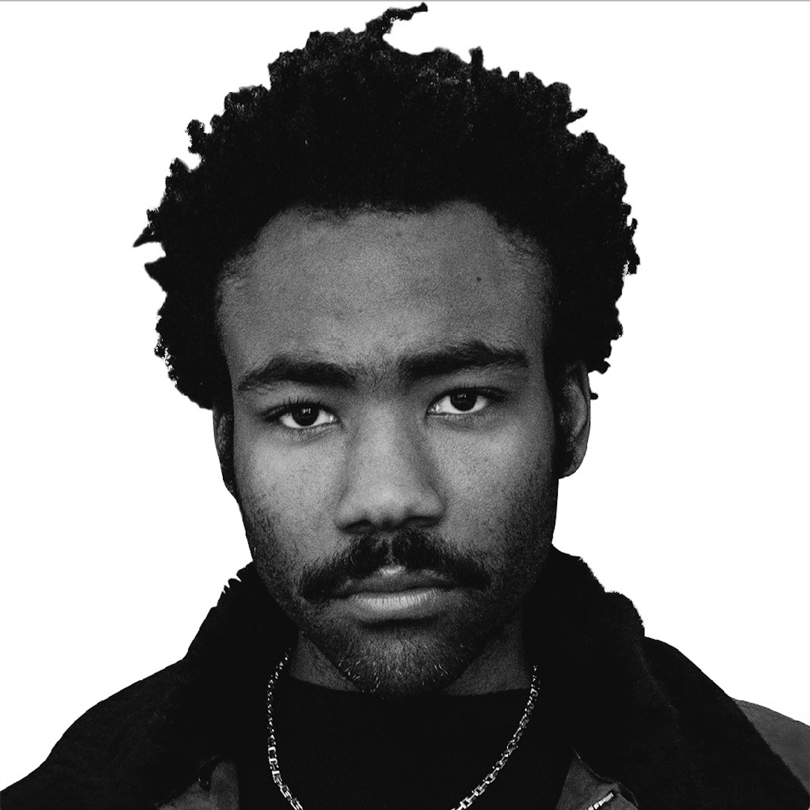
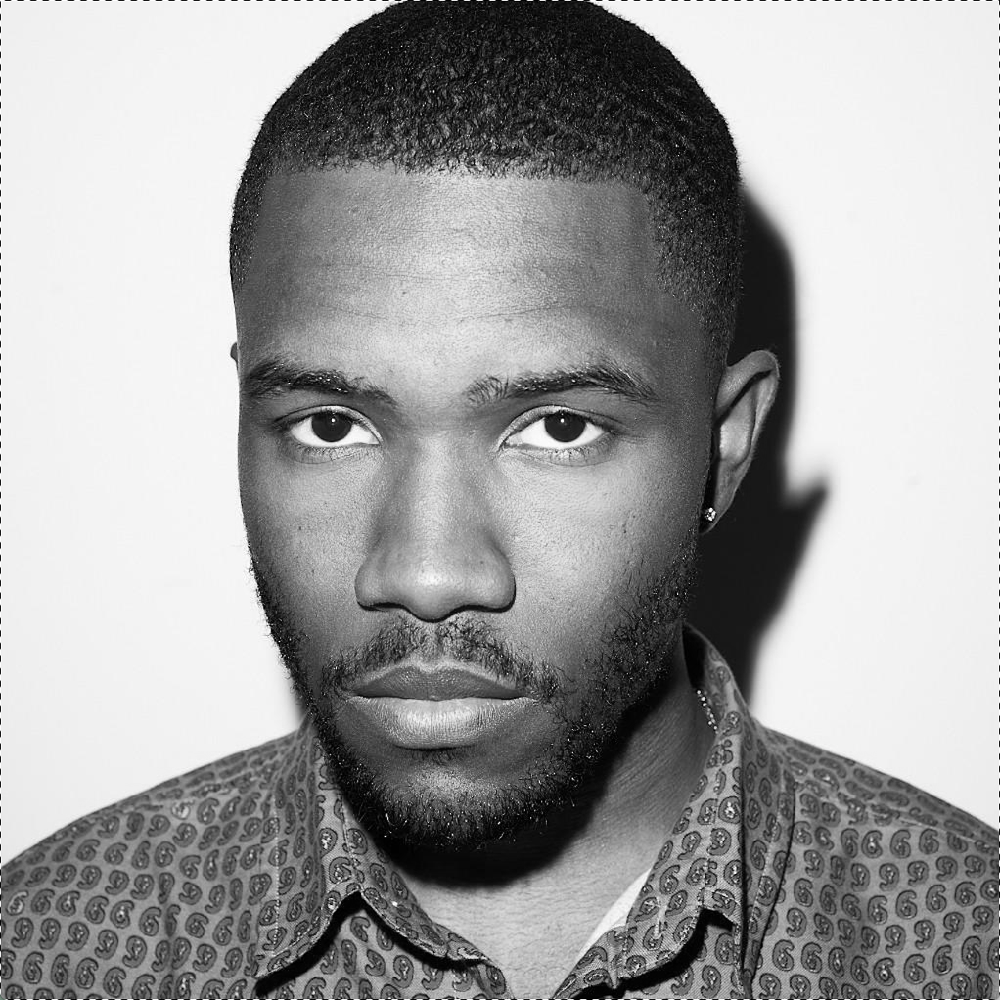
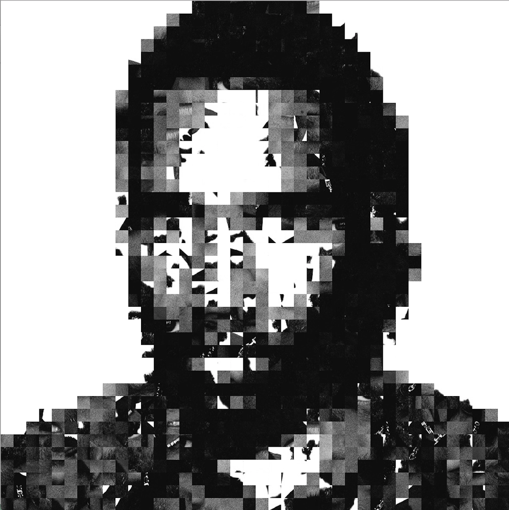

# reuse-pic
Rearranges small squares from a source image to best fit a target image. Extracts small squares of pixels from a source image and uses a Gale-Shapley matching algorithm to assign each square with a corresponding target square. Overlays the new squares onto the target photo. Done on July 14-15th 2018

### How to use
Dependencies: Python3, Pillow

Add selected images into img directory. Change parameters in reuse.py. Run with `python reuse.py`

### Samples
From Picture: Donald Glover

To Picture: Frank Ocean

Result:

